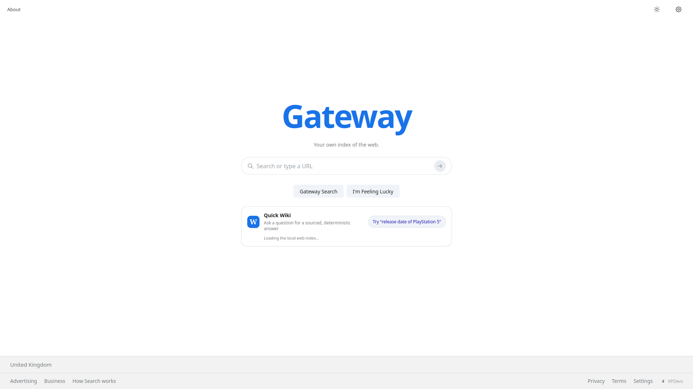

# Gateway Search

A fast, private, multi-source search engine by [XPDevs](https://xpdevs.github.io). Gateway searches a bundled local web index (20,000 entries — 10,321 Wikipedia articles plus 9,679 real websites across 9,609 domains) plus live Wikipedia / Wikidata open data — with no API keys, no build step, and no generative AI.

Live behaviour: main results paint from the local index first (typically milliseconds), while Quick Wiki, spell-check, and web enrichment resolve asynchronously afterwards.

Your searches are recorded to a local-only [search history](history/) you can replay, filter, switch off, or delete. It never leaves the browser and never affects ranking.

## Features

- **Instant main results (faster than Google for the common case)**
  - Two-stage search: Stage 1 renders `gatewaySearchLocal()` (local IndexedDB/memory index only, no network) inside `requestAnimationFrame`; Stage 2 enriches with `gatewayCrawl()` (Wikipedia live, official sites, cited web links) without replacing the visible list.
  - Result stats show measured time, e.g. `120 ranked results (0.03 seconds)`.
  - `content-visibility: auto` on `.result-item`, 20-per-page pagination, in-memory + `localStorage` + IndexedDB caches, request dedup via `_once()` / `_inflight`.
- **Quick Wiki (lazy, sourced, with image)**
  - Deterministic answers from Wikipedia extracts + Wikidata claims (`P577`, `P571`, `P36`, `P1082`, …); date-intent parsing, never generative AI.
  - Renders **after** the main list: skeleton placeholder first, replaced asynchronously when `gatewayQuickWiki()` resolves; failures — or queries Wikipedia cannot answer — clear the skeleton and show **no box at all** without touching results. Can be disabled entirely via Settings (`toggleQuickWiki()` / `setQuickWikiEnabled()` / `gatewayQuickWikiEnabled()`).
  - Summary-only answers are gated on a strong title match (exact or ≥75% subject-word overlap); weak matches return `null`.
  - Answer/context duplicates eliminated: `_dedupeAnswerContext()` strips any context repeating the answer (plus a render-side guard), so the answer sentence never appears twice.
  - Representative image: `pageimages` `thumbnail|original` at 500px, with sibling-article fallback; floated right so body text wraps around it and continues underneath; `` with caption and `onerror` collapse (stacks full-width on mobile).
  - Header badge `No generative AI`, property chip (e.g. `P577`), source links (official + cited, deduped per-domain).
- **XPDevs profile (local, deterministic)**
  - Searching `XPDevs` — or any query containing the token (`xpdevs`, `xp dev`, `xp-dev`, `xpdev`, `gateway search`) — is answered entirely from `XPDEV_PROFILE` in `main.js`, with no network call and no Wikipedia round-trip: Quick Wiki shows the profile answer, the context line, the repository count, source links (website, GitHub, DoorsOS, ExamOS, Genesis-AI) and the project logo `https://xpdevs.github.io/logo/XPDevs.png` with a `XPDevs` source badge (never a false "Wikipedia" badge/caption).
  - The same query pins 62 rows above every ranked result: the official site, the GitHub organisation, Gateway, and **all 59 public repositories** (`github.com/XPDevs/<name>`, each with language, stars, last update and a `fork of an upstream project` flag where applicable). An XPDevs query renders the whole set in one page instead of 20-row pages, so no repository is hidden behind "Show more results".
  - Facts are sourced from the official site (`xpdevs.github.io`: operating systems, United Kingdom, Genesis-AI focus) and the GitHub API; every other query path is untouched.
- **Favicons on every web URL**
  - Each result row and each Quick Wiki source link shows a favicon: Google S2 primary (`s2/favicons?domain=…&sz=32`), DuckDuckGo `icons.duckduckgo.com/ip3/…` fallback, letter-avatar final fallback — so no row is icon-less.
  - Images are `loading="lazy" decoding="async"`.
- **Unique descriptions**
  - All 20,000 `index.json` descriptions are unique and page-specific (verified: 20,000 / 20,000 unique, zero `Official website of X.` boilerplate).
  - 202 former boilerplate entries rewritten per-domain (tourism vs. government vs. curated brand/tech copy); 3 duplicate September-11 victim-list descriptions split by surname range (A–G / H–N / O–Z).
  - 9,477 new entries added (index version `2026-09-27-gateway-index-v4-20000-websites`): 1,110 hand-curated marquee sites (Google, Bing, DuckDuckGo, Yahoo, Brave, Ecosia, Startpage, Yandex, Baidu, Naver, Mojeek, Qwant, Perplexity, …) plus 8,367 harvested sites whose descriptions come from their Wikipedia lead sentence. Every new URL is unique, its `s` field is the normalised host, and every new entry passes `isSafeResult`.
- **Search history (local, reversible)**
  - Every search is recorded to `localStorage` under `gw-history` as `{q, t, n, ms}` — query, time, result count, duration — newest first, capped at 200 entries. Recorded once in `performSearch()` (`main.js`) after the fast local stage paints, so the stored count and duration match what the user actually saw; the Stage 2 enrichment pass corrects the count in place rather than logging a second entry.
  - `/history/` (`history/index.html`) is a standalone static page — it cannot load `main.js`, so it implements the same reader against the same key. Entries are grouped by day, filterable, and each row replays the search via `../?query=…` (already honoured on load by `main.js:1108`).
  - Controls: delete a single search, delete all, export the list as JSON, and a switch to stop recording new searches (`gw-history-optout`). Recording is on by default.
  - Nothing is uploaded, never attached to a search, never included in a custom or exported index, and never used for ranking or profiling. Storage failures (quota, private mode) degrade silently and never break a search.
  - ⚠️ Deliberately **not** named `history`: `performSearch()` uses `window.history.replaceState` (History API), and a global of that name would clobber it. The API surface is `window.gatewaySearchHistory`.
- **BM25 hybrid ranking** (see *Ranking* below) — IDF with additive smoothing, `IDF^1.5` term weighting, Okapi BM25, and a static authority prior.
- **Plus:** 25-language UI, dark mode, autocomplete (`getSuggestions`), `Did you mean?` spell-check, `I'm Feeling Lucky`, uploadable custom index, safe-domain filtering, tracking-param stripping.

## Project structure

```
gateway-main/
├── index.html       # Home + results UI, settings modal
├── ui.css           # Theme, results, Quick Wiki, favicon, responsive styles
├── main.js          # UI, staged search orchestration, rendering (favicons, Quick Wiki image)
├── crawl.js         # Index engine, Wikipedia/Wikidata fetchers, ranking, caches
├── index/
│   ├── index.json       # Bundled local index: [{t, u, d, s}] — 20,000 unique-description entries
│   └── index-meta.json  # Index version + entry count (cache-busting)
├── about/ advertising/ business/ how-search-works/ history/ privacy/ terms/  # Static pages
├── favicon.ico
└── 404.html
```

## Setup

No build, no dependencies. Any static server works:

```bash
cd gateway-main
python3 -m http.server 8000
# open http://localhost:8000/
```

Or `npx serve .`, GitHub Pages, Nginx, etc. Use `http(s)://`, not `file://` (fetch + IndexedDB require it).

Custom index (optional): Settings → Upload Index → select a JSON array of `{t, u, d, s}`. It is validated, persisted to IndexedDB, and versioned (old caches invalidated).

Settings (gear icon): language, dark mode, **Quick Wiki on/off** (persisted as `gw-quickwiki` in `localStorage`, default on — when off, no Quick Wiki box is fetched or rendered and the `Try "release date…"` example re-enables it), and index upload.

## Architecture

```
User query
  ├─ Stage 1 (sync-fast): gatewaySearchLocal() → prepared normalised index → score → _boostXpdevs → paint (rAF) + timing
  ├─ Stage 2a (async): gatewayCrawl() → local + Wikipedia search + official URLs + extlinks → merge new URLs only, re-sort, update count
  ├─ Stage 2b (async, lazy): gatewayQuickWiki() → parse intent → wiki search → best-page match → Wikidata claims → image → renderQuickWiki()
  └─ Stage 2c (async): gatewaySpellCheck() → renderDidYouMean()
```

Key modules:

- `crawl.js`: `_normalize`, `_prepareIndex` (term frequencies, document frequency, `avgdl`, authority), `searchIndex`, `gatewaySearchLocal`, `gatewayCrawl`, `_searchWikipedia` (opensearch → extracts+pageimages+pageprops+info, extlinks for best page), `_wikidataClaims` / `_labelsForClaims` / `_formatWikidataTime`, `quickWiki` (+ `_dedupeAnswerContext`, `_subjectMatchRatio` gating), `getSuggestions`, `spellCheck`, `_dedupeAndRank`, `isSafeResult`, `cleanTracking`, tiered cache (memory → localStorage `gw_v6_` → IndexedDB `GatewayIndex`). Loads the bundled index from `index/index.json` + `index/index-meta.json` via `INDEX_DIR`. Introspection: `gatewayRankDebug(query)`, `gatewayAuthorityScore(domain)`.
- `main.js`: `performSearch` (staged), `_gwRender` (stats with seconds + `renderDidYouMean` + `renderQuickWiki` + paginated `renderItem`), `_faviconHtml` (S2 → DDG → letter), `_answerLinkHtml`, translations (25 locales), dark mode, autocomplete wiring.

## Ranking

Every result — bundled index, live Wikipedia, official sites, cited web links — is scored with one hybrid function, so all sources compete on identical terms.

```
FinalScore = (BM25_Score * 0.8) + (Authority_Score * 0.2)
```

1. **IDF with additive smoothing** — `IDF(q_i) = ln(1 + (N - n(q_i) + 0.5) / (n(q_i) + 0.5))`
   - `N = 20,000,000,000` (web-corpus scale, `RANK_CORPUS_SIZE`; override with `window.GATEWAY_RANK_CORPUS` for self-hosted corpora).
   - `n(q_i)` = document frequency, counted at index load.
2. **Dynamic query term weighting** — `W(q_i) = IDF(q_i) ^ 1.5`, so rare entities are boosted and common terms are damped.
3. **Okapi BM25** — `BM25(D, Q) = Σ W(q_i) · (f(q_i,D) · (k1 + 1)) / (f(q_i,D) + k1 · (1 - b + b · (|D| / avgdl)))`, with `k1 = 1.2`, `b = 0.75`.
   - Documents are `title + description`; `|D|` is the word count; `avgdl` is the mean across the whole index (41.97 words for the bundled set: 839,346 tokens over 20,000 documents, 58,267 distinct terms).
4. **Authority** — a pre-calculated static float in `[0.0, 10.0]`, PageRank-style, resolved per domain: exact table → parent-domain walk (`en.wikipedia.org` → `wikipedia.org`) → public-sector/academic host shapes (`.gov`, `gov.uk`, `gob.ve`, `.edu`, `ac.uk`, …) → deterministic 2.0–6.0 hash band for everything else. It never varies with the query. An index entry may ship its own value in `a`, which always wins.
   - Since authority contributes at most 2.0 points, relevance dominates and authority only breaks ties — the intended 80/20 split.

**Tokenisation.** Query terms are stopword-filtered; single digits are kept (`PlayStation 5`, `World War 2`) while lone letters are dropped. Document text keeps every token, so stopwords still count toward `f` and `|D|`. Matching is whole-token, not substring.

**Removed in this revision:** the old hand-tuned constants (exact-title `+700`, title-prefix `+380`, per-field `+55/+32/+24/+9`, coverage bonus, and the fixed Wikipedia/official/web boosts of `2000/1800/930/280/360/260`). Also fixed a latent `STOPWORDS` bug where `.split(' ')` bound only to the last string literal, so the set held 20 stray characters and **no stopword was ever filtered**.

**Verified** by re-deriving IDF, `W`, BM25 and `FinalScore` from the raw index for 150+ results across 6 queries: max drift `0.0`. Corpus stats (`avgdl` = 41.9673, vocabulary = 58,267) also match an independent count. Warm search averages ~12 ms over 20,000 documents (median 12.4 ms, p95 18.0 ms across 160 timed `gatewaySearchLocal()` calls); one-time index preparation costs ~1.2 s and is cached in memory.

## Performance notes

- First paint never awaits network; network failures cannot blank results.
- `MAX_INDEX_RESULTS=120`, `MAX_RESULTS=100`, `PER_PAGE=20`; each search is one O(20k) pass of Map lookups over precomputed term frequencies — ~12 ms warm (measured over the bundled 20,000-entry index), plus a one-time `df`/`avgdl`/authority precompute of ~1.2 s that is cached in memory.
- To verify: search anything and read `result-stats`, e.g. `(0.04 seconds)`. Compare against Google's typical 0.3–0.6 s SERP time.

## Data notes

- `index/index.json` format: `t` title, `u` URL (tracking params stripped), `d` unique description, `s` normalised domain, `a` optional pre-calculated authority (0.0–10.0; falls back to the domain table when absent).
- Regeneration check: `python3 -c "import json; from collections import Counter; d=json.load(open('index/index.json')); print(len(d), len(set(x['d'] for x in d)))"` → `20000 20000`.
- **Local keys written by the browser** (all removable via site data): `gw-lang`, `gw-dark`, `gw-quickwiki` (preferences); `gw_v6_*` (10-minute search cache, max 30 keys); `gw-history` + `gw-history-optout` (search history, max 200 entries). Nothing else is persisted, and none of it is ever transmitted.

## Security / privacy

- Dangerous domains, private-IP hostnames, non-http(s) URLs, and malware-keyword hits are filtered (`isSafeDomain` / `isSafeResult` / `_safeHref`).
- Tracking params (`utm_*`, `fbclid`, `gclid`, …) and hashes stripped; no third-party analytics; favicon/image loads are the only external requests besides Wikipedia/Wikidata APIs.

## Screenshots

### Homepage

*Clean, minimal interface with instant local search.*

### Search Results

*Results for "Costa Coffee", featuring the Quick Wiki box, result stats, and favicons.*
